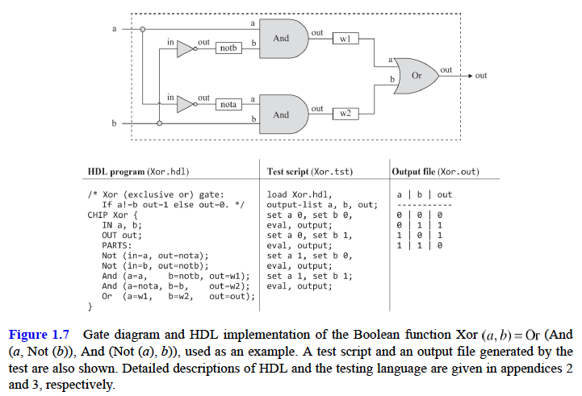

# Boolean Logic

## Boolean Algebra

- **fundamental theorem of logic design**, stipulates that computers can be built from one atom only: a logic gate that realizes the Nand function.
  - any Boolean function can be represented using only And, Or and Not operators. We can even shorten that to only And and Not operators since (a OR b) = Not(Not(a) and Not(b))
  - But since both And and Not can be expressed in terms of Nand => any Boolean function can be represented by a Boolean expression containing only Nand operators.
    - NOT(x) = (x NAND x)
    - AND(x,y) = NOT(x NAND y) = ((x NAND y) NAND (x NAND y))
  - In other words, if we have as many Nand gates as we want, we can wire them in patterns of activation that implement any given Boolean function: all we have to do is figure out the right wiring.

#### Boolean functions

- Every Boolean function can be defined either using truth tables or a Boolean expression
  
- a **truth table** is often a convenient means for describing some states of nature, whereas a **Boolean expression** is a convenient formalism for realizing this description in silicon.
  - The ability to move from one representation to the other is one of the most important practices of hardware design.
  - every Boolean function can be represented by many different yet equivalent Boolean expressions, and some will be shorter and easier to work with.
  - the ability to simplify a Boolean expression is the first step toward hardware optimization

#### Boolean identities

## Logic Gates

- **A gate** is a physical device that implements a simple Boolean function. Today, gates are typically implemented as transistors etched in silicon, packaged as chips.
- computer scientists are content with the abstract notions of Boolean algebra and gate logic, trusting blissfully that someone else—physicists and electrical engineers—will figure out how to actually realize them in hardware.
- the interface of any given gate is unique: there is only one way to specify it, and this is normally done using a truth table, a Boolean expression, or a verbal specification.
- the art of logic design can be described as follows: Given a
  gate abstraction (also referred to as specification, or interface), find an efficient way (as few gates and connections as possible) to implement it using other gates that were already implemented.
- Since all logic gates have the same input and output data types (0’s and 1’s), they can be combined, creating **composite gates** of arbitrary complexity.
  
  

## Hardware Construction

- HDL (figure 1.7)
  - HDL is a functional, declarative language
  - The order of HDL statements is insignificant, but it's customary to write from left to right as statements appear in a diagram
  - VHDL and Verilog are the two most popular HDL languages
  - An HDL definition of a chip consists of a header section and a parts section.
  - The _header_ section specifies the chip interface, listing the chip name and the names of its input and output pins.
  - The _parts_ section describes the chip-parts from which the chip architecture is made. Each chip-part is represented by a single statement that specifies the part name, followed by a parenthetical expression that specifies how it is connected to other parts in the design.
  - Note that in order to write such statements, the HDL programmer must have access to the interfaces of all the underlying chip-parts:
    
- Testing
  - Rigorous quality assurance mandates that chips be tested in a specific, replicable, and well-documented fashion.
  - Hardware simulators are typically designed to run test scripts, written in a scripting language.
- Simulation
  - Writing and debugging HDL programs is similar to conventional software development.
  - The main difference is that instead of writing code in a highlevel language, we write it in HDL, and instead of compiling and running the code, we use a hardware simulator to test it.
    

## Specification

- **NAND** gate
  

#### Basic Logic Gates

- **Not** - Also known as inverter, this gate outputs the opposite value of its input’s value.
  
- **And** - Returns 1 when both its inputs are 1, and 0 otherwise:
  
- **Or** - Returns 1 when at least one of its inputs is 1, and 0 otherwise:
  
- **Xor** - Also known as exclusive or, this gate returns 1 when exactly one of its inputs is 1, and 0 otherwise:
  
- **Multiplexer** (figure 1.9) - A multiplexer is a three-input gate (see figure 1.9). Two input bits, named a and b, are interpreted as data bits, and a third input bit, named sel, is interpreted as a selection bit. The multiplexer uses sel to select and output the value of either a or b.
  
- **Demultiplexer** - A demultiplexer performs the opposite function of a multiplexer: it takes a single input value and routes it to one of two possible outputs, according to a selector bit that selects the destination output.The other output is set to 0.
  

#### Multi-Bit Versions of Basic Gates

- Computer hardware is often designed to process multi-bit values—for
  example, computing a bitwise And function on two given 16-bit inputs.
- the logical architecture of these n-bit gates is the same, irrespective of n’s value (e.g., 16, 32, or 64 bits)
- HDL programs treat multi-bit values like single-bit values, except that the values can be indexed in order to access individual bits.

- **Multi-bit Not**: An n-bit Not gate applies the Boolean operation Not to every one of the bits in its n-bit input
  
- **Multi-bit And**: An n-bit And gate applies the Boolean operation And to every respective pair in its two n-bit inputs:
  
- **Multi-bit Or**: An n-bit Or gate applies the Boolean operation Or to every respective pair in its two n-bit inputs:
  
- **Multi-bit multiplexer**: An n-bit multiplexer operates exactly the same as a basic multiplexer, except that its inputs and output are n-bits wide:
  

#### Multi-Way Versions of Basic Gates

- Logic gates that operate on one or two inputs have natural generalization to multi-way variants that operate on more than two inputs.
- **Multi-way Or**: An m-way Or gate outputs 1 when at least one of its m input bits is 1, and 0 otherwise. We will need an 8-way variant of this gate
  
- **Multi-way/Multi-bit multiplexer**: An m-way n-bit multiplexer selects one of its m n-bit inputs, and outputs it to its n-bit output. The selection is specified by a set of k selection bits.
  
  - Our target computer platform requires two variants of this chip: a 4-way 16-bit multiplexer and an 8-way 16-bit multiplexer:
    
- **Multi-way/Multi-bit demultiplexer**: An m-way n-bit demultiplexer routes its single n-bit input to one of its m n-bit outputs. The other outputs are set to 0. The selection is specified by a set of k selection bits.
  
  - Our target computer platform requires two variants of this chip: a 4-way 1-bit demultiplexer and an 8-way 1-bit demultiplexer:
    
