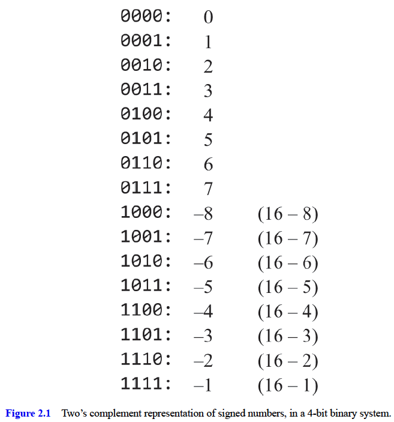
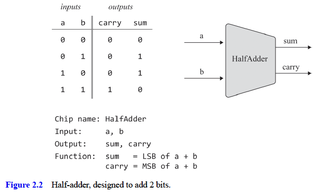
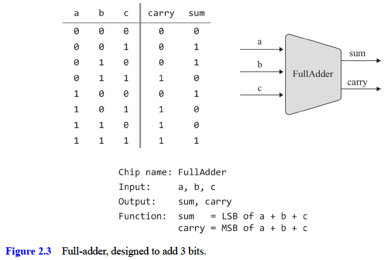
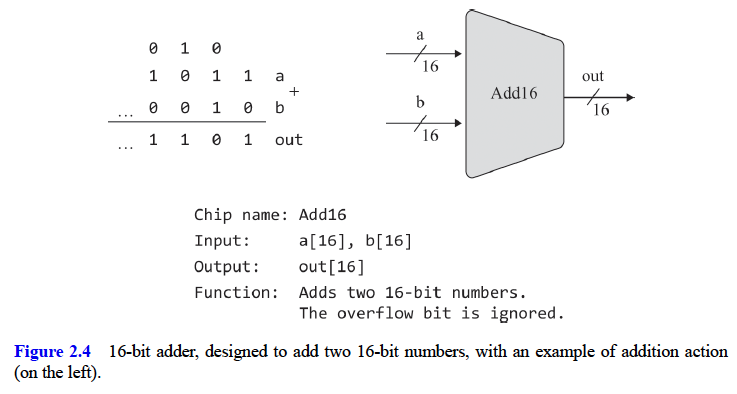
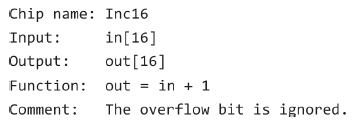
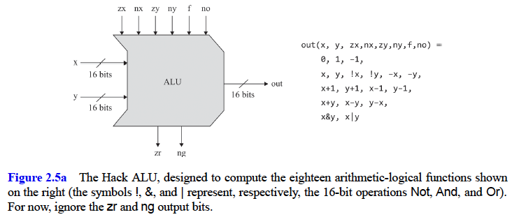
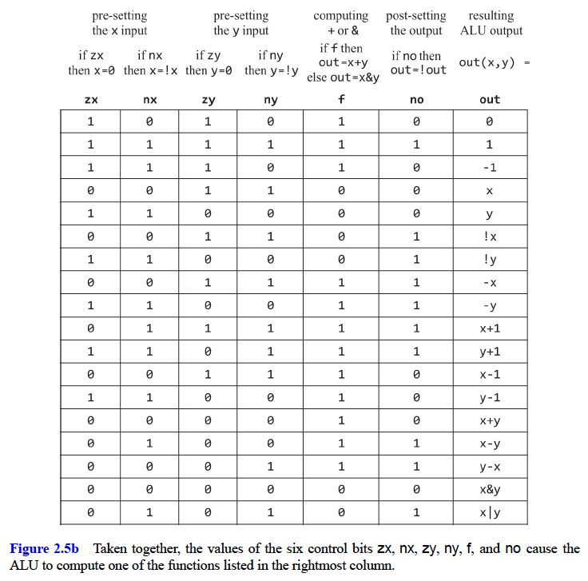
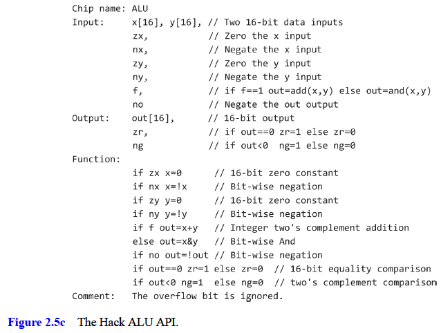

# Boolean Arithmetic

General-purpose computer systems are required to perform at least the following arithmetic operations on signed integers:

- addition
- sign conversion
- subtraction
- comparison
- multiplication
- division

Remarkably, all the functions performed by digital computers—not only arithmetic operations—can be reduced to adding binary numbers.

#### Binary Numbers

- Inside computers, everything is represented using binary codes.
- Since humans insist on dealing with numbers using decimal codes, computers have to work hard behind the scenes to carry out binary-to-decimal and decimal-to-binary conversions whenever humans want to see, or supply, numeric information. At all other times computers stick to binary.
- Word size is a common hardware term used for specifying the number of bits that computers use for representing a basic chunk of information—in this case, integer values. Typically, 8-, 16-, 32-, or 64-bit registers are used for representing integers
  - suppose we use 8-bit registers for representing integers.
    This representation can code different things.
- A pair of binary numbers can be _added_ bitwise from right to left, using the same decimal addition algorithm learned in elementary school.
  - First, we add the two rightmost bits, also called the least significant bits (LSB) of the two binary numbers.
  - Next, we add the resulting carry bit to the sum of the next pair of bits. We continue this lockstep process until the two left most significant bits (MSB) are added.
  - If the most significant bitwise addition generates a carry of 1, we have what is known as **overflow**. What to do with overflow is a matter of decision,

#### Signed binary numbers

- If we have to represent signed (positive and negative) numbers in binary code, a natural solution is to split the available code space into two subsets
-

##### Two's complement

- The solution used today in almost all computers is called the **two’s complement method**, also known as radix complement.
- In a binary system that uses a word size of n bits, the two’s complement binary code that represents negative x is taken to be the code that represents `2**n - x`.
  - For example, in a 4- bit binary system, -7 is represented using the binary code associated with 2\*\*4 - 7 = 9, which happens to be 1001. Recalling that +7 is represented by 1001 + 0111 = 0000 (ignoring the overflow bit).
    
- The system codes 2\*\*n signed numbers
- The code of any nonnegative number begins with a 0
- The code of any negative number begins with a 1.
- Range of positive numbers is `0..2**(n-1) - 1`
- Range of negative numbers is `-1..-2**(n-1)`
- To obtain the binary code of -x from the binary code of x, leave all the least significant 0-bits and the first least significant 1-bit of x intact, and flip all the remaining bits (convert 0’s to 1’s and vice versa). Alternatively, flip all the bits of x and add 1 to the result.
- the two’s complement method enables adding and subtracting signed numbers using nothing more than the hardware required for adding nonnegative numbers.
  - This works because both addition and representation is modulo 2 to the n (we throw the overflow bits). The result that we get is correct up to an additive 2 to the n at the additive factor.
  - subtraction is handled as a special case of addition
- every arithmetic operation, from multiplication to division to square root, can be implemented reductively using binary addition.
- the two’s complement method is one of the most remarkable and unsung heroes of applied computer science.

## Hierarchy of chips

#### Adders

- **Half-adder**: designed to add two bits
  
- **Full-adder**: designed to add three bits
  
- **Adder**: designed to add two n-bit numbers
  - Computers represent integer numbers using a fixed word size like 8, 16, 32, or 64 bits. The chip whose job is to add two such n-bit numbers is called adder.
    
- **Incrementer**: When we later design our computer architecture, we will need a chip that adds 1 to a given number
  

#### ALU - Arithmetic Logic Unit

- an Arithmetic Logic Unit is a chip that will later become the computational centerpiece of our CPU
- an Arithmetic Logic Unit is a chip designed to compute a set of arithmetic and logic operations. Exactly which operations an ALU should feature is a design decision derived from cost-effectiveness considerations.
- The ALU could for example take two data inputs and a function (arithmetic or logic function) input and output the result of running the function input with the data inputs
- the Hack ALU operates on two 16-bit two’s complement integers, denoted x and y, and on six 1-bit inputs, called control bits. These control bits “tell” the ALU which function to compute.
  
- The resulting ALU is simple and elegant. And in the hardware business, simplicity and elegance carry the day.
  
- Note that the ALU actually computes a total of sixty-four functions, since six control bits code that many possibilities. We’ve decided to focus on, and document, only eighteen of these possibilities, since these will suffice for supporting the instruction set of our target computer system.
  
- in addition to computing the specified function on its two inputs, the ALU also computes the two output bits zr and ng. These bits, which flag whether the ALU output is zero or negative, respectively, will be used by the future CPU of our computer system.

#### Perspective

- The overall functionality of any hardware/software system is delivered jointly by the CPU and the operating system that runs on top of the hardware platform.
- Thus, when designing a new computer system, the question of how to allocate the desired functionality between the ALU and the OS is essentially a cost/performance dilemma.
  - As a rule, direct hardware implementations of arithmetic and logical operations are more efficient than software implementations but make the hardware platform more expensive.
- The trade-off that we have chosen in Nand to Tetris is to design a basic ALU with minimal functionality, and use system software to implement additional mathematical operations as needed. For example, our ALU features neither multiplication nor division.
- when a high-level programmer writes an expression like, say x\*12 + sqrt(y), then, following compilation, some parts of the expression will be evaluated directly by the ALU and some by the OS, yet the high-level programmer will be completely oblivious to this low-level division of work Indeed, one of the key roles of an operating system is closing gaps between the highlevel language abstractions that programmers use and the barebone hardware on which they are realized.
