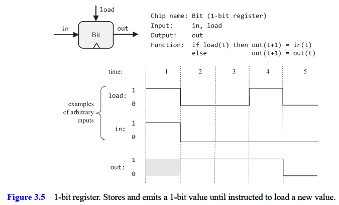
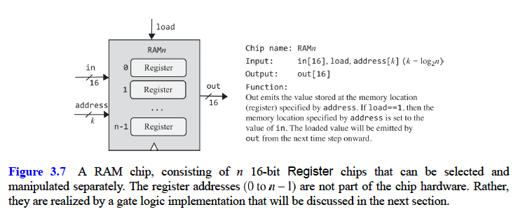

# Memory

- **Memory chips** are developed to stor values over time
  - They can be set to “contain” a value and persist it until we set it to another
    value
- **Combination chips / time-independent chips** were created in chapters 1 & 2 - they respond to different combinations of their inputs without delay, except for the time it takes their inner chip-parts to complete the computation
  
- **Sequential / clocked chips** - Unlike combinational chips, which are oblivious to time, the outputs of
  sequential chips depend not only on the _inputs in the current time_ but also
  on _inputs and outputs that have been processed previously_.
- To use sequential chips we need a logic to model the progression of time. This can be done using a _clock_ that generates an ongoing train of binary signals that we call _tick_ and _tock_.
  - The time between the beginning of a tick and the end of the
    subsequent tock is called a **cycle**, and these cycles will be used to regulate the operations of all the memory chips used by the computer.

## Time

- instead of viewing time as a continuous progression, we prefer to break it into fixed-length intervals, called cycles. This representation is _discrete_
- cycles are _atomic_ and _indivisible_: changes in the world occur only during cycle transitions; within cycles, the world stands still.
  
- by treating time discretely, we make a conscious decision to ignore continuous change. We are content to know the state of the world in cycle n, and then in cycle n+1 (caring less about the state _during_ a cycle)
- 2 design objectives of discrete view of time
  - First, it can be used for neutralizing the randomness associated with communications and computation time delay
  - Second, it can be used for synchronizing the operations of different chips across the system,

### Cycle Length

- the cycle’s length must be longer than the maximal time delays that can occur in the system. Indeed, cycle length is one of the most important design parameters of any hardware platform:
- When planning a computer, the hardware engineer chooses a cycle length that meets two design objectives.
  - On the one hand, the cycle should be sufficiently long to contain, and neutralize, any possible time delay;
  - on the other hand, the shorter the cycle, the faster the computer
- To sum up, the cycle length is chosen to be slightly longer than the maximal time delay in any chip in the system.
- Following the tremendous progress in switching technologies, we are now able to create cycles as tiny as a billionth of a second, achieving remarkable computer speed.
- Typically, the cycles are realized by an oscillator that alternates continuously between two phases labeled _0−1_, _low-high_, or _ticktock_
- Using the hardware’s circuitry, the same master clock signal is simultaneously broadcast to every memory chip in the system. In every such chip, the clock input is funneled to the lower-level DFF gates, where it serves to ensure that the chip will commit to a new state, and output it, only at the end of the clock cycle.

## data flip-flops (DFF)

- Memory chips are designed to “remember”, or store, information over time. The low-level devices that facilitate this storage abstraction are named **flipflop gates**, of which there are several variants.
- data input and the clock input enable the DFF to implement the simple time-based behavior `out(t)=in(t-1)` where `in` and `out` are the gate’s input and output values, and `t` is the current time unit
  
- DFF gates lie deep in the hardware hierarchy. As shown in figure 3.1, all the memory chips in the computer—registers, RAM units, and counters—are based, at bottom, on DFF gates.
- At the end of each clock cycle, the outputs of all the DFFs in the computer commit to their inputs from the previous cycle. At all other times, the DFFs are _latched_, meaning that changes in their inputs have no immediate effect on their outputs.
- Hardware implementations realize the time dependency using a dedicated clock bus that feeds the master clock signal simultaneously to all the DFF gates in the system. Hardware simulators emulate the same effect in software.
- DFF is the most fundamental sequential gate, and any chip that includes it, either directly or indirectly, is also said to be sequential.
- the DFF introduces an inherent time delay so that the output at time `t` does not depend on itself but rather on the output at time `t-1`
  

## Memory Chips

the memory chips that are typically used in computer architectures:

- **data flip-flops (DFFs)** - The most elementary sequential device that we will use—the basic component from which all other memory chips will be constructed—is the data flip-flop.
  - A DFF gate has a single-bit data input, a single-bit data
    output, a clock input, and a simple time-dependent behavior: `out(t) = in(t-1)`
  - Usage: If we put a one-bit value in the DFF’s input, the DFF’s state will be set to this value, and the DFF’s output will emit it in the next time unit. This humble operation will prove most useful in the implementation of registers
- **registers** (based on DFFs) - We present a single-bit register, named Bit, and a 16-bit register, named Register. The Bit chip is designed to store a single bit of information — 0 or 1 — over time. The chip interface consists of an in input that carries a data bit, a load input that enables the register for writes, and an out output that emits the current state of the register.
  
  - irrespective of the input value, as long as the load bit is not asserted, the register is latched, maintaining its current state.
  - The 16-bit Register chip behaves exactly the same as the Bit chip, except that it is designed to handle 16-bit values.
    
  - _Usage_: The Bit register and the 16-bit Register are used identically. To read the state of the register, probe the value of `out`. To set the register’s state to `v`, put `v` in the `in` input, and assert (put 1 into) the `load` bit. This will set the register’s state to `v`, and, from the next time unit onward, the register will commit to the new value, and its out output will start emitting it. We see that the Register chip fulfills the classical function of a memory device: it remembers and emits the last value that was written into it, until we set it to another value.
- **RAM devices** (based on registers) - A direct-access memory unit, also called Random Access Memory, or RAM, is an aggregate of n Register chips. By specifying a particular address (a number between 0 to n-1), each register in the RAM can be selected and made available for read/write operations.
  - Importantly, the access time to any randomly selected memory register is instantaneous and independent of the register’s address and the size of the RAM. That’s what makes RAM devices so remarkably useful: even if they contain billions of registers, we can still access and manipulate each selected register directly, in the same instantaneous access time.
    
  - _Usage_: To read the contents of register number m, set the address input to `m`. This action will select register number `m`, and the RAM’s output will emit its value. To write a new value `v` into register number `m`, set the address input to `m`, set the in input to `v`, and assert the `load` bit (set it to 1). This action will select register number `m`, enable it for writing, and set its value to `v`. In the next time unit the RAM’s output will start emitting `v`.
    - In the case of a read operation (load=0), the RAM’s output immediately emits the value of the selected register. In the case of a write operation (load==1), the selected memory register is set to the input value, and the RAM’s output will start emitting it from the next time unit onward.
- **counters** (based on registers)
  - The Counter is a chip that knows how to increment its value by 1 each time unit.
  - The interface of our PC chip is identical to that of a register, except that it also has control bits labeled `inc` and `reset`. When `inc=1`, the counter increments its state in every clock cycle, effecting the operation PC++.
  - If we want to reset the counter to 0, we assert the `reset` bit; if we want to set the counter to the value `v`, we put `v` in the `in` input and assert the `load` bit, as we normally do with registers.
    
  - _Usage_: To read the current contents of the PC, probe the `out` pin. To reset the PC, assert the `reset` bit and set the other control bits to `0`. To have the PC increment by 1 in each time unit until further notice, assert the `inc` bit and set the other control bits to `0`. To set the PC to the value `v`, set the `in` input to `v`, assert the `load` bit, and set the other control bits to `0`.

## Implementation

- _Data Flip Flop_
  - A DFF gate is designed to be able to “flip-flop” between two stable states, representing 0 and representing 1.
  - we will treat the DFF as a primitive building block.
- _Registers_
  - Register chips are memory devices: they are expected to implement the basic behavior `out(t+1) = out(t)`, remembering and emitting their state over time.
    
  - a natural way to resolve input ambiguity is introducing a multiplexer into the design. The load bit of the overall register chip can then be funneled to the select bit of the inner multiplexer: If we set this bit to 1, the multiplexer will feed the `in` value into the DFF; if we set the load bit to 0, the multiplexer will feed the DFF’s previous output. This will yield the behavior “if load, set the register to a new value, else set it to the previously stored value”—exactly how we want a register to behave.
  - Once we’ve completed the implementation of the single-bit Bit register, we can move on to constructing a w-bit register. This can be achieved by forming an array of w Bit chips
  - The Bit register is the only chip in the Hack architecture that uses a DFF gate directly; all the higher-level memory devices in the computer use DFF chips indirectly, by virtue of using Register chips made of Bit chips.
- _RAM_
  - The Hack hardware platform requires a RAM device of 16K (16384) 16-bit registers, so that’s what we have to implement.
    
  - Each RAM chip has `n` registers, and the width of its address input is k=log~2~n bits.
  - A RAM8 chip features 8 registers for `n=8`. Each register can be selected by setting the RAM8’s 3-bit address input to a value between 0 and 7.
  - since combinational logic is time independent, the access time to any individual register will be nearly instantaneous.
  - To recap, we take an aggregate of an unlimited number of registers, and impose on it a combinational superstructure that permits direct access to any individual register.
  - Once we’ve implemented the RAM8 chip, we can move on to
    implementing a RAM64 chip. The implementation can be based on eight RAM8 chip-parts. To select a particular register from the RAM64 memory, we use a 6-bit address, say xxxyyy. The xxx bits can be used to select one of the RAM8 chips and the yyy bits can be used to select one of the registers within the selected RAM8. This hierarchical addressing scheme can be effected by gate logic. The same implementation idea can guide the implementation of the remaining RAM512, RAM4K, and RAM16K chips.
- Counter
  - A counter is a memory device that can increment its value in every time unit. In addition, the counter can be set to 0 or some other value. The basic storage and counting functionalities of the counter can be implemented, respectively, by a Register chip and by the incrementer chip built in project 2. The logic that selects between the counter’s `inc`, `load`, and `reset` modes can be implemented using some of the multiplexers built in project 1.
