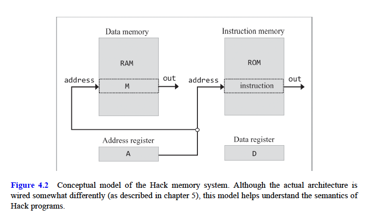
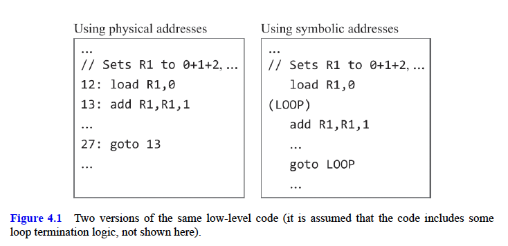
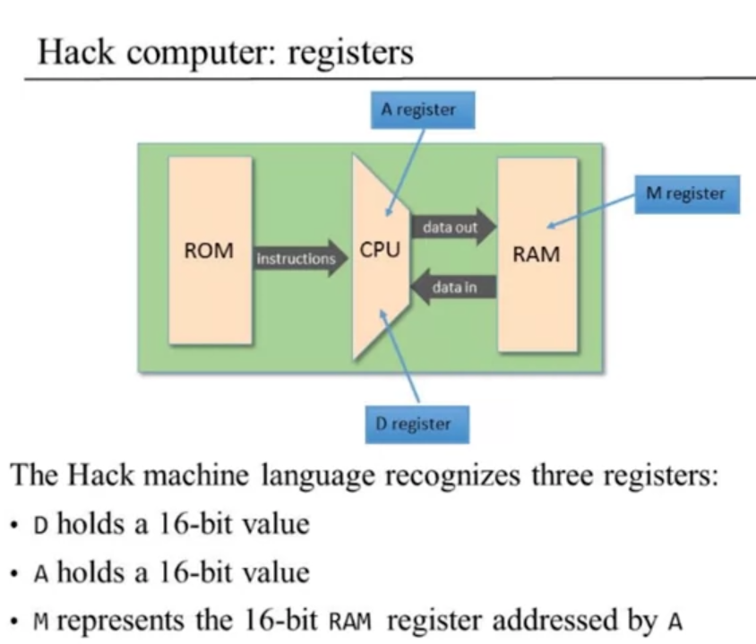
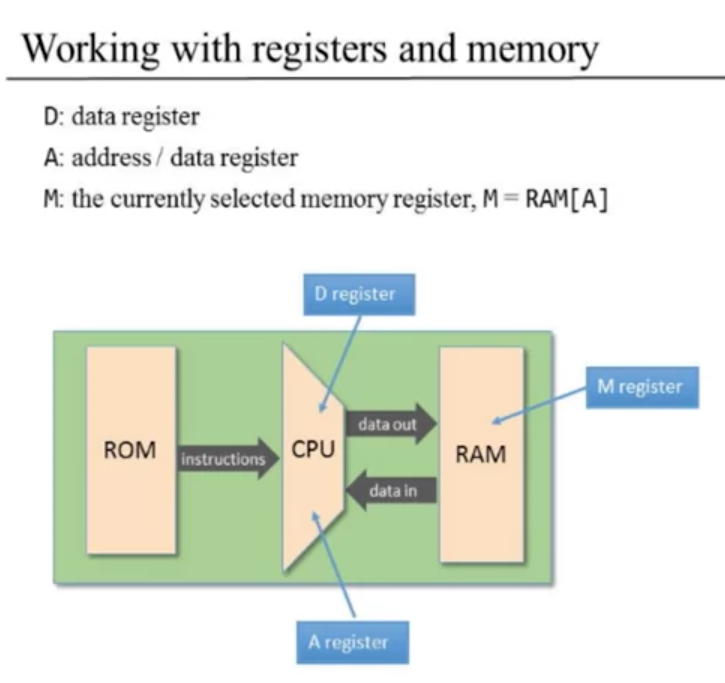
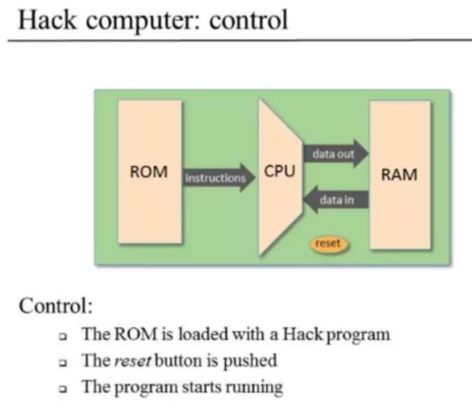
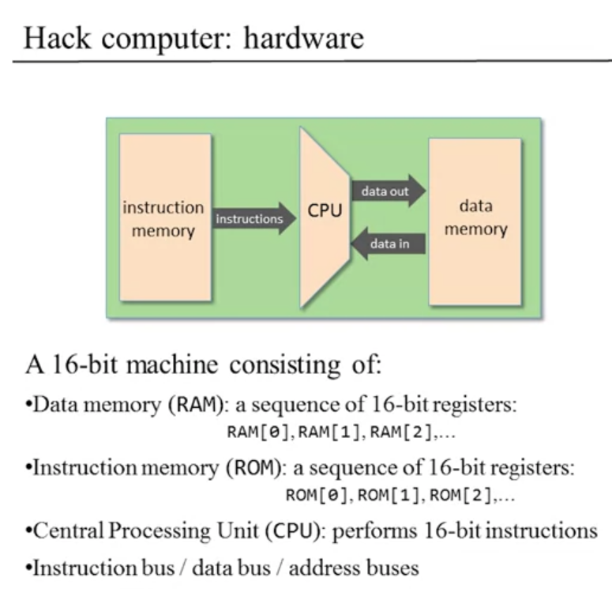
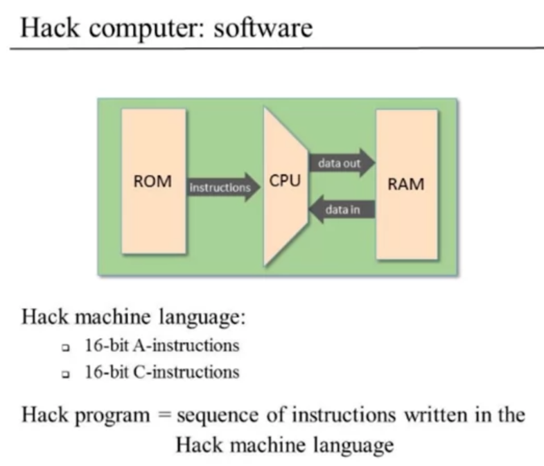
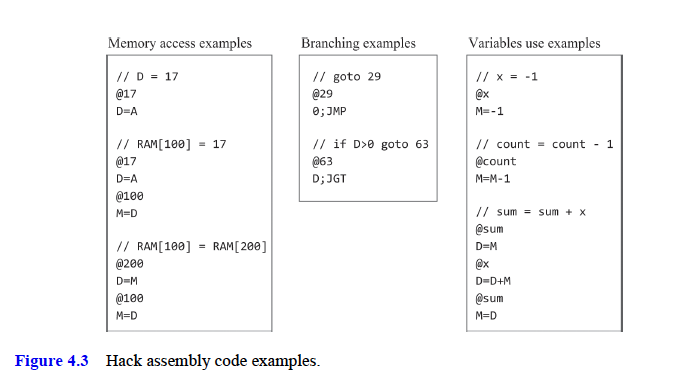
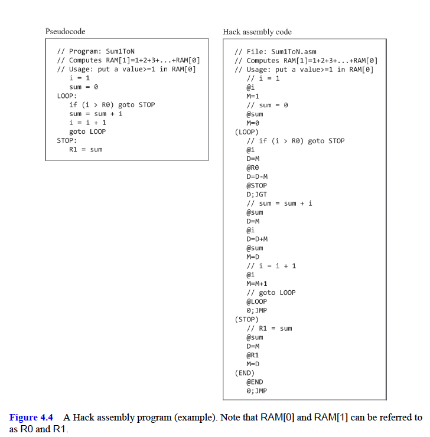

# Machine Language

- [Machine Language](#machine-language)
  - [Machine Language Description](#machine-language-description)
  - [Machine Language Hardware Elements](#machine-language-hardware-elements)
  - [Machine Languages](#machine-languages)
  - [Instructions](#instructions)
  - [Hack Machine And Language for this course](#hack-machine-and-language-for-this-course)

## Machine Language Description

A **machine language** is an agreed-upon formalism designed to code
machine instructions.

- Using these instructions, we can instruct the computer’s processor to perform
  - arithmetic and logical operations
  - read and write values from and to the computer’s memory
  - test Boolean conditions
  - decide which instruction to fetch and execute next.
- Unlike high-level languages, whose design goals are cross-platform compatibility and power of expression, machine languages are designed to effect direct execution in, and total control of, a specific hardware platform.
- Machine language is the most profound interface in the computer enterprise—the fine line where hardware meets software.
  - This is the point where the abstract designs of humans, as manifested in high-level programs, are finally reduced to physical operations performed in silicon.
- Thus, a machine language can be construed as both a programming artifact and an integral part of the hardware platform.
  - we can say that the machine language is designed to control a particular hardware platform, or
  - we can say that the hardware platform is designed to execute instructions written in a particular machine language.

## Machine Language Hardware Elements

- A machine language can be viewed as an agreed-upon formalism designed to manipulate a _memory_ using a _processor_ and a set of _registers_.
- **Memory**: The term memory refers loosely to the collection of hardware devices that store data and instructions in a computer.
  - Functionally speaking, a memory is a continuous sequence of cells, also referred to as locations or memory registers, each having a unique address.
  - An individual memory register is accessed by supplying its address.
  - Memory hierarchy: Lower levels are harder to access but can store more information - Registers (inside CPU) - address & data registers - Cache - Main Memory - Disk
    
- **Processor**: The processor, normally called the Central Processing Unit, or CPU, is a device capable of performing a fixed set of primitive operations.
  - These include arithmetic and logical operations, memory access operations, and control (also called branching) operations.
  - The processor draws its inputs from selected registers and memory locations and writes its outputs to selected registers and memory locations.
  - It consists of an ALU, a set of registers, and gate logic that enables it to parse and execute binary instructions.
- **Registers**: The processor and the memory are implemented as two separate, standalone chips, and moving data from one to the other is a relatively slow affair.
  - For this reason, processors are normally equipped with several onboard registers, each capable of holding a single value.
  - Located inside the processor’s chip, the registers serve as a high-speed local memory, allowing the processor to manipulate data and instructions without having to venture outside the chip.
  - The CPU-resident registers fall into two categories:
    - **data registers**, designed to hold data values, and
    - **address registers**, designed to hold values that can be interpreted either as data values or as memory addresses.

## Machine Languages

- Machine language programs can be written in two alternative, but equivalent, ways: binary and symbolic.
- In the early days of computer systems, computers were programmed manually: When proto-programmers wanted to issue the instruction “set R1 to the value of R1+R2”, they pushed up and down mechanical switches that stored a binary code like 1010110001000001 in the computer’s instruction memory. Of course debugging such programs was a perfect nightmare.
- This led programmers to invent and use symbolic codes as a convenient way for documenting and debugging programs on paper, before entering them into the computer.
- symbolic machine languages are called _assembly languages_, and the programs that translate them into binary code are called _assemblers_.
- Unlike the syntax of high-level languages, which is portable and hardware independent, the syntax of an assembly language is tightly related to the low-level details of the target hardware
- Differences between machine languages
  - Richness of set of operations (division?, bulk copy)
  - Data types (width, floating point...)

## Instructions

- **Arithmetic and logical operations**: Every machine language features instructions for performing basic arithmetic operations like addition and subtraction, as well as basic logical operations like And, Or, Not.
- **Memory access**: Every machine language features means for accessing, and then manipulating, selected memory locations.This is typically done using an _address register_
- **Flow control**: While computer programs execute by default sequentially, one instruction after another, they also include occasional jumps to locations other than the next instruction.
  - To facilitate such branching actions, machine languages feature several variants of conditional and unconditional goto instructions, as well as label declaration statements that mark the goto destinations.
- **Symbolic & Physical References**: the code version that uses symbolic references is much easier to write, debug, and maintain.
  - Further, unlike the code that uses physical addresses, the translated binary version of the code that uses symbolic references can be loaded into, and executed from, any memory segment that happens to be available in the computer’s memory.
  - Therefore, low-level code that mentions no physical addresses is said to be _relocatable_.
  - Clearly, relocatable code is essential in computer systems like PCs and cell phones, which routinely load and execute multiple apps dynamically and simultaneously.
    

## Hack Machine And Language for this course

