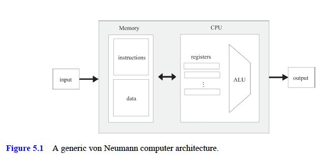
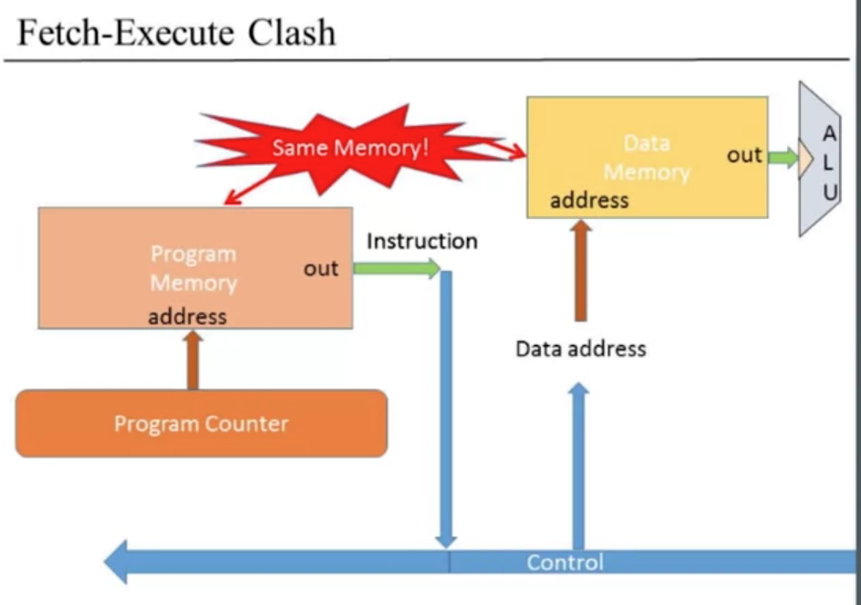

# Computer Architecture

- [Computer Architecture](#computer-architecture)
  - [Intro](#intro)
  - [5.1 Computer Architecture Fundamentals](#51-computer-architecture-fundamentals)
    - [The Stored Program Concept](#the-stored-program-concept)
    - [The von Neumann Architecture](#the-von-neumann-architecture)
    - [Memory](#memory)
      - [Data Memory](#data-memory)
      - [Instruction Memory](#instruction-memory)
    - [CPU](#cpu)
      - [ALU](#alu)
      - [Registers](#registers)
      - [Control](#control)
      - [Fetch-Execute](#fetch-execute)
    - [Input and Output](#input-and-output)
  - [Hack Computer - diagrams](#hack-computer---diagrams)

## Intro

- We are now ready to take the chips that we built in chapters 1–3 and integrate them into a general-purpose computer system, capable of running programs written in the machine language presented in chapter 4.

## 5.1 Computer Architecture Fundamentals

### The Stored Program Concept

- the most remarkable feature of the digital computer is its amazing versatility.
- This remarkable versatility—a boon that we have come to take for granted—is the fruit of a
  brilliant early idea called the stored program concept.
- Formulated independently by several scientists and engineers in the 1930s, the stored
  program concept is still considered the most profound invention in, if not
  the very foundation of, modern computer science.
- The computer is based on a fixed hardware platform capable of executing a
  fixed repertoire of simple instructions. At the same time, these instructions
  can be combined like building blocks, yielding arbitrarily sophisticated
  programs.
- the program’s code is temporarily stored in the computer’s memory, like data, becoming what is known as _software_.
- the same hardware platform can be made to behave
  completely differently each time it is loaded with a different program.

### The von Neumann Architecture

- The stored program concept is the key element of both abstract and
  practical computer models, most notably the Turing machine (1936) and the
  von Neumann machine (1945).
- **The Turing machine** — an abstract artifact describing a deceptively simple computer—is used mainly in theoretical computer science for analyzing the logical foundations of computation.
- In contrast, the **von Neumann machine** is a practical model that informs the construction of almost all computer platforms today.
- The von Neumann architecture, shown in figure 5.1, is based on a Central Processing Unit (CPU), interacting with a memory device, receiving data from some input device, and emitting data to some output device. At the heart of this architecture lies the _stored program concept_: the computer’s memory stores not only the data that the computer manipulates but also the instructions that tell the computer what to do.
  

### Memory

- The computer’s Memory can be discussed from both physical and logical perspectives.
  - _Physically_, the memory is a linear sequence of addressable, fixed-size registers, each having a unique address and a value.
  - _Logically_, this address space serves two purposes: storing data and storing instructions.
- All the memory registers—irrespective of their roles—are handled the same way: to access a particular memory register, we supply the register’s address.
- The term **Random Access Memory** derives from the important requirement that each randomly selected memory register can be reached instantaneously, that is, within the same cycle (or time step)
- In some variants of the von Neumann architecture, the data memory and the instruction memory are allocated and managed dynamically, as needed, _within the same physical address space_. In other variants, the data memory and the instruction memory are kept in _two physically separate memory units_, each having its own distinct address space.

#### Data Memory

- High-level programs are designed to manipulate abstract artifacts like variables, arrays, and objects. Yet at the hardware level, these data abstractions are realized by binary values stored in memory registers.

#### Instruction Memory

- Before a high-level program can be executed on a target computer, it must first be translated into the machine language of the target computer.
- Each high-level statement is translated into one or more low-level instructions, which are then written as binary values to a file called the **binary**, or **executable**, version of the program.
- Before running a program, we must first load its binary version from a mass storage device, and serialize its instructions into the computer’s instruction memory.
- What’s important is that when the CPU is called upon to execute a program, the
  program’s code will already reside in the computer’s memory.

### CPU

- The Central Processing Unit (CPU)—the centerpiece of the computer’s architecture—is in charge of executing the instructions of the currently running program.
- Each instruction tells the CPU which computation to perform, which registers to access, and which instruction to fetch and execute next.
- The CPU executes these tasks using three main elements:
  - An Arithmetic Logic Unit (ALU)
  - a set of registers
  - a control unit

#### ALU

- The ALU chip is built to perform all the low-level arithmetic and logical operations featured by the computer.
- A typical ALU can add two given values, compute their bitwise And, compare them for equality, and so on.
- In general, any function not supported by the ALU can be realized later, using system software running on top of the hardware platform. The trade-off is simple:
  - _hardware implementations_ are typically more efficient but result in more expensive hardware
  - _software implementations_ are inexpensive and less efficient.

#### Registers

- In the course of performing computations, the CPU is often required to store interim values temporarily
- Memory registers would entail long-distance trips between the CPU and the RAM, which are two separate chips.
  - These delays would frustrate the CPU-resident ALU, which is an ultra-fast combinational calculator. The result will be a condition known as **starvation**, which is what happens when a fast processor depends on a sluggish data store for supplying its inputs and consuming its outputs.
- In order to avert starvation and boost performance, we normally equip the CPU with a small set of high-speed (and relatively expensive) registers, acting as the processor’s immediate memory.
- These registers serve various purposes:
  - **data registers** store interim values
  - **address registers** store values that are used to address the RAM
  - the **program counter** stores the address of the instruction that should be fetched and executed next
  - the **instruction register** stores the current instruction.
- A typical CPU uses a few dozen such registers

#### Control

- A **computer instruction** is a _structured package of agreed-upon micro-codes_, that is, sequences of one or more bits designed to signal different devices what to do.
  - Thus, before an instruction can be executed, it must first be decoded into its micro-codes.
  - Next, each micro-code is routed to its designated hardware device (ALU, registers, memory) within the CPU, where it tells the device how to partake in the overall execution of the instruction.

#### Fetch-Execute

- In each step (cycle) of the program’s execution, the CPU fetches a binary machine instruction from the instruction memory, decodes it, and executes it.
- **fetch-execute cycle** - As a side effect of the instruction’s execution, the CPU also figures out which instruction to fetch and execute next.

### Input and Output

- Computers interact with their external environments using a great variety of
  input and output (I/O) devices: screens, keyboards, storage devices,
  printers, microphones, speakers, network interface cards etc. plus the bewildering array of sensors and activators embedded in automobiles, cameras, hearing aids, alarm systems, and all the gadgets around us
- There are two reasons why we don’t concern ourselves with
  these I/O devices.
  - First, every one of them represents a unique piece of machinery, requiring a unique knowledge of engineering.
  - **memory-mapped I/O** - Second, for that very same reason, computer scientists have devised clever schemes for abstracting away this complexity and making all I/O devices look exactly the same to the computer in the way of a memory-mapped I/O
    - The basic idea is to create a binary emulation of the I/O device, making it
      appear to the CPU as if it were a regular linear memory segment. This is
      done by allocating, for each I/O device, a designated area in the computer’s
      memory that acts as its memory map.
    - Programmatically, the key implication is that low-level computer program can access any I/O device by manipulating its designated memory map.
    - The practical implications of memory-mapped I/O are significant: The computer system is totally independent of the number, nature, or make of the I/O devices that interact, or may interact, with it.
    - Whenever we want to connect a new I/O device to the computer, all we have to do is allocate to it a new memory map and take note of the map’s base address (these onetime configurations are carried out by the so-called **installer programs**).
    - Another necessary element is a **device driver program**, which is added to the computer’s operating system.
      - This program bridges the gap between the I/O device’s memory map data and the way this data is actually rendered on, or generated by, the physical IO device.

## Hack Computer - diagrams

